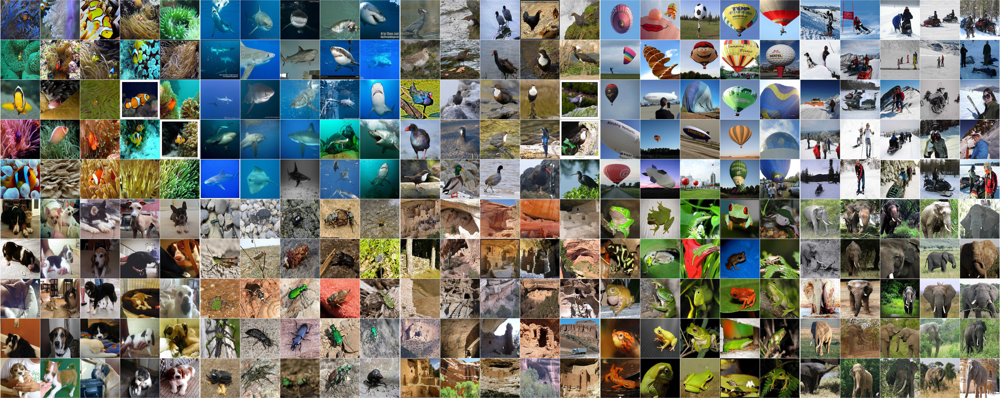
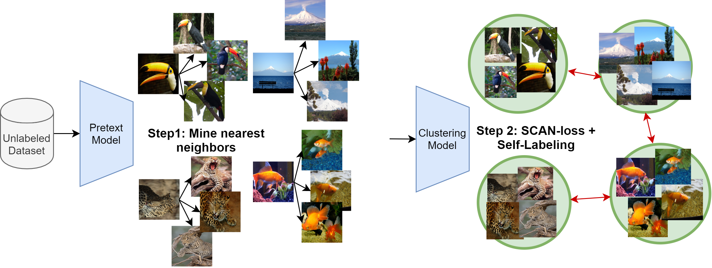

# Learning to Classify Images without Labels


This repo contains the Pytorch implementation of our paper:
> [**SCAN: Learning to Classify Images without Labels**](https://arxiv.org/pdf/2005.12320.pdf)
>
> [Wouter Van Gansbeke](https://twitter.com/WGansbeke), [Simon Vandenhende](https://twitter.com/svandenh1), [Stamatios Georgoulis](https://twitter.com/stam_g), Marc Proesmans and Luc Van Gool.

- __Accepted at ECCV 2020 ([Slides](https://wvangansbeke.github.io/wvangansbeke.github.io/pdfs/unsupervised_classification.pdf)). Watch the explanation of our paper by Yannic Kilcher on [YouTube](https://www.youtube.com/watch?v=hQEnzdLkPj4).__

- 🏆 __SOTA on 4 benchmarks. Check out [Papers With Code](https://paperswithcode.com/paper/learning-to-classify-images-without-labels) for [Image Clustering](https://paperswithcode.com/task/image-clustering) or [Unsup. Classification](https://paperswithcode.com/task/unsupervised-image-classification).__

- 🆕 __Interested in unsupervised semantic segmentation? Check out our recent work: [MaskContrast](https://github.com/wvangansbeke/Unsupervised-Semantic-Segmentation).__
<p align="center">
    
<p align="center">
    


[](https://paperswithcode.com/sota/unsupervised-image-classification-on-imagenet?p=learning-to-classify-images-without-labels)
[](https://paperswithcode.com/sota/unsupervised-image-classification-on-cifar-10?p=learning-to-classify-images-without-labels)
[](https://paperswithcode.com/sota/unsupervised-image-classification-on-stl-10?p=learning-to-classify-images-without-labels)
[](https://paperswithcode.com/sota/unsupervised-image-classification-on-cifar-20?p=learning-to-classify-images-without-labels)
</p>


## Contents
1. [Introduction](#introduction)
0. [Problems with Prior Work](#problems-with-prior-work)
0. [Installation](#installation)
0. [Training](#training)
0. [Model Zoo](#model-zoo)
0. [Tutorial](#tutorial)
0. [Citation](#citation)

🆕 Tutorial section has been added, checkout [TUTORIAL.md](https://github.com/wvangansbeke/Unsupervised-Classification/blob/master/TUTORIAL.md).

🆕 Prior work section has been added, checkout [Problems Prior Work](#problems-prior-work).

## Introduction
Can we automatically group images into semantically meaningful clusters when ground-truth annotations are absent? The task of unsupervised image classification remains an important, and open challenge in computer vision. Several recent approaches have tried to tackle this problem in an end-to-end fashion. In this paper, we deviate from recent works, and advocate a two-step approach where feature learning and clustering are decoupled.

We outperform state-of-the-art methods by large margins, in particular +26.6% on CIFAR10, +25.0% on CIFAR100-20 and +21.3% on STL10 in terms of classification accuracy.  Our method is the first to perform well on ImageNet (1000 classes).
__Check out the benchmarks on the [Papers-with-code](https://paperswithcode.com/paper/learning-to-classify-images-without-labels) website for [Image Clustering](https://paperswithcode.com/task/image-clustering) and [Unsupervised Image Classification](https://paperswithcode.com/task/unsupervised-image-classification).__

## Problems with Prior Work
- Train set includes test set:
We would like to point out that most prior work in unsupervised classification use both the train and test set during training. We believe this is bad practice and therefore propose to only train on the training set. The final numbers should be reported on the test set (see table 3 of our paper). This also allows us to directly compare with supervised and semi-supervised methods in the literature. We encourage future work to do the same. So our numbers are expected to be better when we also include the test set for training.

- Reproducibility: 
We noticed that prior work is very initialization sensitive. So, we don't think reporting a single number is therefore fair. We report our results as the mean and standard deviation over 10 runs. 

Please follow the instructions underneath to perform semantic clustering with SCAN.

## Installation
The code runs with recent Pytorch versions, e.g. 1.4. 
Assuming [Anaconda](https://docs.anaconda.com/anaconda/install/), the most important packages can be installed as:
```shell
conda install pytorch=1.4.0 torchvision=0.5.0 cudatoolkit=10.0 -c pytorch
conda install matplotlib scipy scikit-learn   # For evaluation and confusion matrix visualization
conda install faiss-gpu                       # For efficient nearest neighbors search 
conda install pyyaml easydict                 # For using config files
conda install termcolor                       # For colored print statements
```
We refer to the `requirements.txt` file for an overview of the packages in the environment we used to produce our results.

## Training

### Setup
The following files need to be adapted in order to run the code on your own machine:
- Change the file paths to the datasets in `utils/mypath.py`, e.g. `/path/to/cifar10`.
- Specify the output directory in `configs/env.yml`. All results will be stored under this directory. 

Our experimental evaluation includes the following datasets: CIFAR10, CIFAR100-20, STL10 and ImageNet. The ImageNet dataset should be downloaded separately and saved to the path described in `utils/mypath.py`. Other datasets will be downloaded automatically and saved to the correct path when missing.

### Train model
The configuration files can be found in the `configs/` directory. The training procedure consists of the following steps:
- __STEP 1__: Solve the pretext task i.e. `simclr.py`
- __STEP 2__: Perform the clustering step i.e. `scan.py`
- __STEP 3__: Perform the self-labeling step i.e. `selflabel.py`

For example, run the following commands sequentially to perform our method on CIFAR10:
```shell
python simclr.py --config_env configs/your_env.yml --config_exp configs/pretext/simclr_cifar10.yml
python scan.py --config_env configs/your_env.yml --config_exp configs/scan/scan_cifar10.yml
python selflabel.py --config_env configs/your_env.yml --config_exp configs/selflabel/selflabel_cifar10.yml
```
### Remarks
The provided hyperparameters are identical for CIFAR10, CIFAR100-20 and STL10. However, fine-tuning the hyperparameters can further improve the results. We list the most important hyperparameters of our method below:
- Entropy weight: Can be adapted when the number of clusters changes. In general, try to avoid imbalanced clusters during training. 
- Confidence threshold: When every cluster contains a sufficiently large amount of confident samples, it can be beneficial to increase the threshold. This generally helps to decrease the noise. The ablation can be found in the paper. 
- Number of neighbors in SCAN: The dependency on this hyperparameter is rather small as shown in the paper. 

## Model Zoo
### Pretext tasks
We perform the instance discrimination task in accordance with the scheme from [SimCLR](https://arxiv.org/abs/2002.05709) on CIFAR10, CIFAR100 and STL10. Pretrained models can be downloaded from the links listed below. On ImageNet, we use the pretrained weights provided by [MoCo](https://github.com/facebookresearch/moco) and transfer them to be compatible with our code repository. 

| Dataset          | Download link |
|------------------|---------------| 
|CIFAR10           | [Download](https://drive.google.com/file/d/1Cl5oAcJKoNE5FSTZsBSAKLcyA5jXGgTT/view?usp=sharing)  |
|CIFAR100          | [Download](https://drive.google.com/file/d/1huW-ChBVvKcx7t8HyDaWTQB5Li1Fht9x/view?usp=sharing)  |
|STL10             | [Download](https://drive.google.com/file/d/1261NDFfXuKR2Dh4RWHYYhcicdcPag9NZ/view?usp=sharing)  |

### Clustering
We provide the following pretrained models after training with the __SCAN-loss__, and after the __self-labeling__ step. The best models can be found here and we futher refer to the paper for the averages and standard deviations.

| Dataset          | Step              | ACC                   |  NMI            |  ARI      |Download link |
|------------------|-------------------|---------------------- |-----------------|-----------|--------------|
| CIFAR10          |  SCAN-loss        | 81.6                  | 71.5            | 66.5      |[Download](https://drive.google.com/file/d/1v6b6jJY5M4-duSqWpGFmdf9e9T3dPrx0/view?usp=sharing)  |
|                  |  Self-labeling    | 88.3                  | 79.7            | 77.2      |[Download](https://drive.google.com/file/d/18gITFzAbQsGS5vt8hyi5HjbeRDsVLihw/view?usp=sharing) |
| CIFAR100         |  SCAN-loss        | 44.0                  | 44.9            | 28.3      |[Download](https://drive.google.com/file/d/1pPCi1QG05kP_JdoX29dxEhVddIRk68Sd/view?usp=sharing)  |
|                  |  Self-labeling    | 50.7                  | 48.6            | 33.3      |[Download](https://drive.google.com/file/d/11mEmpDMyq63pM4kmDy6ItHouI6Q__uB7/view?usp=sharing)  |
| STL10            |  SCAN-loss        | 79.2                  | 67.3            | 61.8      |[Download](https://drive.google.com/file/d/1y1cnGLpeTVo80cnWhAJy-B72FYs2AjZ_/view?usp=sharing)  |
|                  |  Self-labeling    | 80.9                  | 69.8            | 64.6      |[Download](https://drive.google.com/file/d/1uNYN9XOMIPb40hmxOzALg4PWhU_xwkEF/view?usp=sharing)  |
| ImageNet-50      |  SCAN-loss        | 75.1                  | 80.5            | 63.5      |[Download](https://drive.google.com/file/d/1UdBtvCHVGd08x8SiH6Cuh6mQmqsADg0t/view?usp=sharing)  |
|                  |  Self-labeling    | 76.8                  | 82.2            | 66.1      |[Download](https://drive.google.com/file/d/1iOE4_lQ4w7CGPLU4algBDG34nz68eN8o/view?usp=sharing)  |
| ImageNet-100     |  SCAN-loss        | 66.2                  | 78.7            | 54.4      |[Download](https://drive.google.com/file/d/1tcROQ3wc_MbxmLr05qt-UvF9yVrBwBq9/view?usp=sharing)  |
|                  |  Self-labeling    | 68.9                  | 80.8            | 57.6      |[Download](https://drive.google.com/file/d/1VVgRpJ9DJn9dNrbAKbfPer2FllTvP6Cs/view?usp=sharing)  |
| ImageNet-200     |  SCAN-loss        | 56.3                  | 75.7            | 44.1      |[Download](https://drive.google.com/file/d/1oO-OCW2MiXmNC4sD6pkw8PurYScX7oVW/view?usp=sharing)  |
|                  |  Self-labeling    | 58.1                  | 77.2            | 47.0      |[Download](https://drive.google.com/file/d/11dfobUwy6ragh7PoqFagoEns5-teWalm/view?usp=sharing)  |

### Result ImageNet
We also train SCAN on ImageNet for 1000 clusters. We use 10 clusterheads and finally take the head with the lowest loss. The accuracy (ACC), normalized mutual information (NMI), adjusted mutual information (AMI) and adjusted rand index (ARI) are computed:

 Method          | ACC                   |  NMI            |  AMI | ARI   |  Download link | 
|----------------|---------------------- |-----------------|------|-------|----------------| 
| SCAN (ResNet50)           | 39.9                  | 72.0            | 51.2 |  27.5 |[Download](https://drive.google.com/file/d/1PcF8ydoWoqhxARGuW55KcNarfZyJwcza/view?usp=sharing) |
 


### Evaluation
Pretrained models from the model zoo can be evaluated using the `eval.py` script. For example, the model on cifar-10 can be evaluated as follows:
```shell
python eval.py --config_exp configs/scan/scan_cifar10.yml --model $MODEL_PATH 
```
Visualizing the prototype images is easily done by setting the `--visualize_prototypes` flag. For example on cifar-10:
<p align="center">
    
</p>

Similarly, you might want to have a look at the clusters found on ImageNet (as shown at the top). First download the model (link in table above) and then execute the following command:
```shell
python eval.py --config_exp configs/scan/imagenet_eval.yml --model $MODEL_PATH_IMAGENET 
```


## Tutorial

If you want to see another (more detailed) example for STL-10, checkout [TUTORIAL.md](https://github.com/wvangansbeke/Unsupervised-Classification/blob/master/TUTORIAL.md). It provides a detailed guide and includes visualizations and log files with the training progress.

## Citation

If you find this repo useful for your research, please consider citing our paper:

```bibtex
@inproceedings{vangansbeke2020scan,
  title={Scan: Learning to classify images without labels},
  author={Van Gansbeke, Wouter and Vandenhende, Simon and Georgoulis, Stamatios and Proesmans, Marc and Van Gool, Luc},
  booktitle={Proceedings of the European Conference on Computer Vision},
  year={2020}
}

```
For any enquiries, please contact the main authors.

## License

This software is released under a creative commons license which allows for personal and research use only. For a commercial license please contact the authors. You can view a license summary [here](http://creativecommons.org/licenses/by-nc/4.0/).

## Acknoledgements
This work was supported by Toyota, and was carried out at the TRACE Lab at KU Leuven (Toyota Research on Automated Cars in Europe - Leuven).
