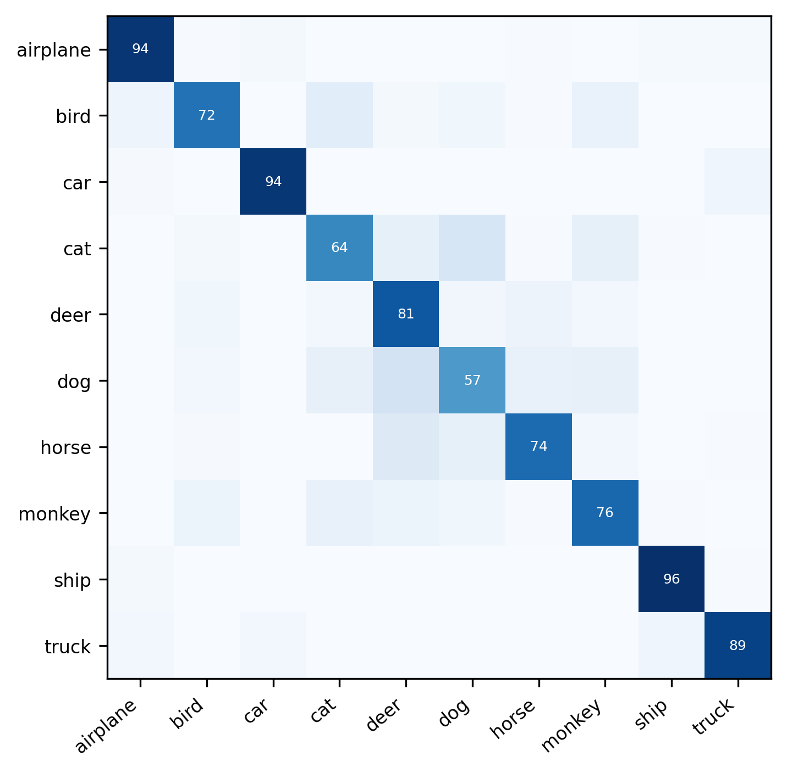

# Tutorial: Semantic Clustering on STL-10 with SCAN

You can follow this guide to obtain the semantic clusters with SCAN on the STL-10 dataset. The procedure is equivalent for the other datasets. 

## Contents
1. [Preparation](#preparation)
0. [Pretext task](#pretext-task)
0. [Semantic clustering](#semantic-clustering)
0. [Visualization](#visualization)
0. [Citation](#citation)

## Preparation
### Repository
Clone the repository and navigate to the directory:
```bash
git clone https://github.com/wvangansbeke/Unsupervised-Classification.git
cd  Unsupervised-Classification
```

### Environment
Activate your python environment containing the packages in the README.md.
Make sure you have a GPU available (ideally a 1080TI or better) and set $gpu_ids to your desired gpu number(s):
```bash
conda activate your_anaconda_env
export CUDA_VISIBLE_DEVICES=$gpu_ids
```
I will use an environment with Python 3.7, Pytorch 1.6, CUDA 10.2 and CUDNN 7.5.6 for this example.

### Paths
Adapt the path in `configs/env.yml` to `repository_eccv/`, since this directory will be used in this tutorial. 
Make the following directories. The models will be saved there, other directories will be made on the fly if necessary.
```bash
mkdir repository_eccv/
mkdir repository_eccv/stl-10/
mkdir repository_eccv/stl-10/pretext/
```
Set the path in `utils/mypath.py` to your dataset root path as mentioned in the README.md

## Pretext task
First we will run the pretext task (i.e. SimCLR) on the train+unlabeled set of STL-10. 
Feel free to run this task with the correct config file:
```
python simclr.py --config_env configs/env.yml --config_exp configs/pretext/simclr_stl10.yml 
```

In order to save time, we provide pretrained models in the README.md for all the datasets discussed in the paper. 
First, download the pretrained model [here](https://drive.google.com/file/d/1261NDFfXuKR2Dh4RWHYYhcicdcPag9NZ/view?usp=sharing) and save it in your experiments directory. Then, move the downloaded model to the correct location (i.e. `repository_eccv/stl-10/pretext/`) and calculate the nearest neighbors. This can be achieved by running the following commands:
```bash
mv simclr_stl-10.pth.tar repository_eccv/stl-10/pretext/checkpoint.pth.tar  # Move model to correct location
python tutorial_nn.py --config_env configs/env.yml --config_exp configs/pretext/simclr_stl10.yml    # Compute neighbors
```

You should get the following results:
```
> Restart from checkpoint repository_eccv/stl-10/pretext/checkpoint.pth.tar
> Fill memory bank for mining the nearest neighbors (train) ...
> Fill Memory Bank [0/10]
> Mine the nearest neighbors (Top-20)
> Accuracy of top-20 nearest neighbors on train set is 72.81
> Fill memory bank for mining the nearest neighbors (val) ...
> Fill Memory Bank [0/16]
> Mine the nearest neighbors (Top-5)
> Accuracy of top-5 nearest neighbors on val set is 79.85
```
Now, the model has been correctly saved for the clustering step and the nearest neighbors were computed automatically. 

## Semantic clustering

We will start the clustering procedure now. Simply run the command underneath. The nearest neighbors and pretext model will be loaded automatically:
```bash
python scan.py --config_env configs/env.yml --config_exp configs/scan/scan_stl10.yml
```

On average, you should get around 75.5% (as reported in the paper). I get around 80% for this run.
As can be seen, the best model is selected based on the lowest loss on the validation set. 
A complete log file is included in `logs/scan_stl10.txt`. It can be viewed in color with `cat logs/scan_stl10.txt` in your terminal.
```
> Epoch 100/100
> Adjusted learning rate to 0.00010
> Train ...
> Epoch: [99][ 0/39]    Total Loss -1.0914e+01 (-1.0914e+01) Consistency Loss 5.4953e-01 (5.4953e-01)    Entropy 2.2927e+00 (2.2927e+00)
> Epoch: [99][25/39]    Total Loss -1.0860e+01 (-1.0824e+01) Consistency Loss 6.0039e-01 (6.2986e-01)    Entropy 2.2920e+00 (2.2908e+00)
> Make prediction on validation set ...
> Evaluate based on SCAN loss ...
> {'scan': [{'entropy': 2.298224687576294, 'consistency': 0.4744518995285034, 'total_loss': -1.8237727880477905}], 'lowest_loss_head': 0, 'lowest_loss': -1.8237727880477905}
> No new lowest loss on validation set: -1.8248 -> -1.8238
> Lowest loss head is 0
> Evaluate with hungarian matching algorithm ...
> {'ACC': 0.79, 'ARI': 0.6165977838702869, 'NMI': 0.6698521018927263, 'Top-5': 0.9895, 'hungarian_match': [(0, 7), (1, 3), (2, 1), (3, 5), (4, 2), (5, 0), (6, 8), (7, 9), (8, 4), (9, 6)]}
> Checkpoint ...
> Evaluate best model based on SCAN metric at the end
> {'ACC': 0.8015, 'ARI': 0.6332440325942004, 'NMI': 0.6823369373831116, 'Top-5': 0.990625, 'hungarian_match': [(0, 7), (1, 3), (2, 1), (3, 5), (4, 2), (5, 0), (6, 8), (7, 9), (8, 4), (9, 6)]}  ]
```

## Visualization
Now, we can visualize the confusion matrix and the prototypes of our model. We define the prototypes as the most confident samples for each cluster. We visualize the sample which is the closest to the mean embedding of its confident samples for each cluster. Run the following command:
```bash
python eval.py --config_exp configs/scan/scan_stl10.yml --model repository_eccv/stl-10/scan/model.pth.tar --visualize_prototypes
```
As can be seen from the confusion matrix, the model confuses primarily between visually similar classes (e.g. cats, dogs and monkeys). Some images are classified near perfection (e.g. ship) without the use of ground truth.
<p align="center">
    
</p>
<p align="center">
    
</p>


## Citation

If you find this tutorial useful for your research, please consider citing our paper:

```bibtex
@inproceedings{vangansbeke2020scan,
  title={Scan: Learning to classify images without labels},
  author={Van Gansbeke, Wouter and Vandenhende, Simon and Georgoulis, Stamatios and Proesmans, Marc and Van Gool, Luc},
  booktitle={Proceedings of the European Conference on Computer Vision},
  year={2020}
}
```
